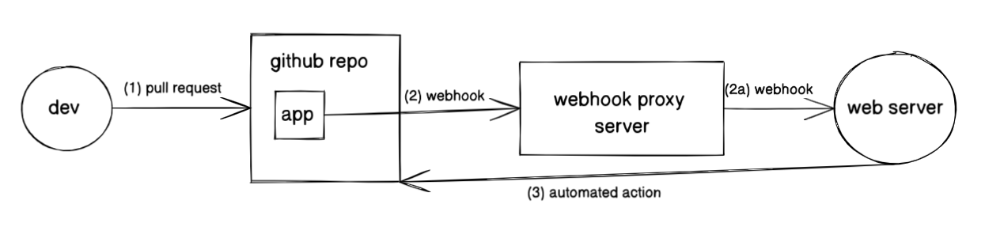

# github-bot

This repo is a demo of how a Github app can summarize and review pull requests. The actual code of the app is in `github-app`, and is deployed as a Github App using the [probot library](https://probot.github.io/).

The code in github-app also spins up a local webserver as well as a webhook proxy using `smee.io`.

There are two key piece of functionality to the app:

- Autosummarization of python files that were in a PR. When a PR is opened, the `shekar-bot` automatically summarizes the changes
- Approval of a PR on demand. If you type in `shekar-bot review`, `shekar-bot` will automatically approve the PR with a friendly comment.

Check out [this sample PR](https://github.com/shekarramaswamy4/github-bot/pull/7) or the demo video below to see it in action.

## Demo Video

https://www.loom.com/share/8f733d5e6b2c4140af39516fb57fad7b

## How it works

First, a repo must allow access to the Github app. This is as simple as going to repo settings -> Github apps. The Github app acts as an authenticated agent to send webhooks and take actions on github resources.

On PR creation and special comments, a webhook is sent from the app to the specified url in the app.

The webhook is then processed by a target server and actions are taken appropriately.

## Running + Testing locally

Pull the repo, and run `yarn dev` in the `github-app` directory.

You have two options to develop the app:

- use the same source code, but spin up a github app in your own repository
- ask me for the .env file and collaborator access to try it out on this repository

## Known Limitations

Since this is a Github App, it isn't possible to actually mention the bot using the "@" symbol. This could take away the "magic" of a separate AI agent, but only marginally so in my opinion. Additionally, in my experience, companies are more hesitant to allow full access to a "bot user" masquerading as a real user.

The alternative was to create a full fledged separate user and automate their actions, which requires a bit more work as you'd need to handle oauth in a separate webserver. However, the code itself would largely stay the same.

Between a Github app and a separate oauth'd user, the core code and functionality would approximately be equivalent. As a result, I decided to use a Github app as an MVP because it would be quicker to implement.

## Deploying in an customer's environment

Here are the steps that would be needed if we were to integrate this to an end customer. This would be the most advanced form of the integration, where they want to do everything within their own environment. Parts of this can be simplified if users are more comfortable with a hybrid approach.

- We give them a template to deploy their own Github app
- We give them a webserver (similar to `index.ts`) to run in house on their own infrastructure. It will be dockerized and easily deployable within their environment. I also included a simple healthcheck endpoint to the webserver to show how this could work in a standard Kubernetes environment.
- We give them a model fine tuned on their data, similar to what's going on in `huggingface.ts`.

And that's it!

There are a lot more complicated things we can do with Github's `octokit`, including leaving comments on specific lines of code or even updating PRs ourselves with unit tests. Everything is customizable.
